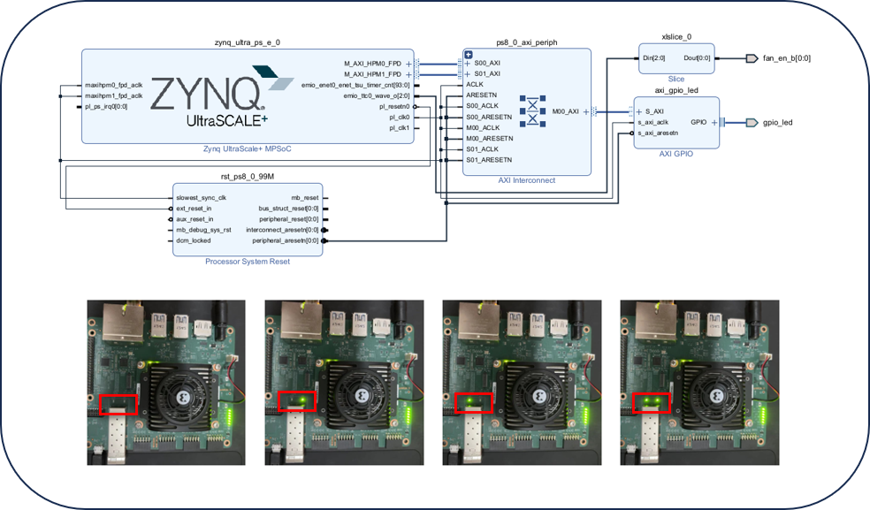
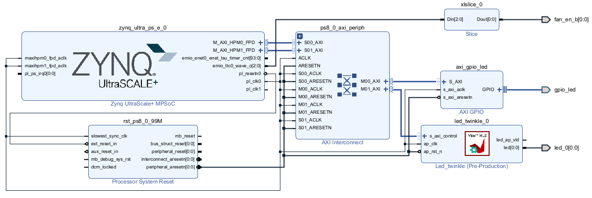

# kr260-autofocus-vision-system

使用软件
- Vitis HLS 2022.2
- Vivado 2022.2

> 参考资料：
> - [kr260-robotics-starter](https://www.amd.com/zh-cn/products/system-on-modules/kria/k26/kr260-robotics-starter-kit.html)
> - [kr260-robotics-ai-study](https://www.hackster.io/512359/amd-pervasive-ai-developer-contest-robotics-ai-study-guide-ae74d6)

## Test
### led
Relevant information about the board, including the schematic and .xdc files, was obtained. The DS9 and DS10 LEDs on the KR260 development board were controlled by exporting GPIO in Vivado, and the fan pins were also exported for control.
After synthesis and implementation, the `.bit` and `.hwh` files were obtained. Logged into PYNQ, used Jupyter to load the `.bit` file, and controlled the GPIO.

### led_twinkle

Using HLS, a custom `led_twinkle` IP was created to achieve a LED blinking effect. Simple C++ code was written and converted to IP using the Vitis HLS tool, then loaded into Vivado.
Similarly, after synthesis and implementation, the `.bit` and `.hwh` files were obtained. Logged into PYNQ, used Jupyter to load the `.bit` file, and the LEDs automatically blinked without any additional control.

